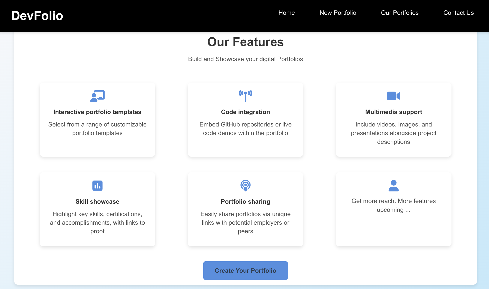

# Build Your Portfolio
<!-- 
Instruction to Run the web application -->
## DEMO 


## Backend
1. Open a terminal
2. Go to backend directory 
    ```bash
    cd DigitalPortfolioBuilder/backend/
    ```
3. Run server
    ```bash
    npm run start
    ```

## Frontend
1. Open a terminal
2. Go to backend directory 
    ```bash
    cd DigitalPortfolioBuilder/frontend/
    ```
3. Run server
    ```bash
    npm start
    ```